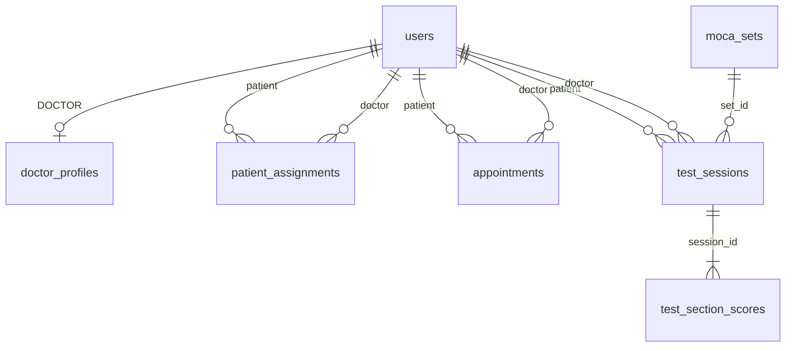

# MoCA Platform — SQL & entity map

> Last updated: 2026-06-28 · Source: `backend/src/main/resources/db/migration/`

## Database

- Engine: PostgreSQL 16
- Migration path: `backend/src/main/resources/db/migration/`
- Latest: `V1__initial_schema.sql`, `V2__user_phone_identity.sql`
- Planned: `V3__moca_sets.sql` (table exists in `docs/data-object/data.sql` only)

## Entity index

| Table (SQL) | Entity (Java) | Status | API (planned / live) |
|-------------|---------------|--------|----------------------|
| `users` | `UserEntity` | ✅ mapped | `POST /api/auth/doctor/login`, `POST /api/auth/patient/login` |
| `doctor_profiles` | `DoctorProfileEntity` | ❌ table only | — |
| `patient_assignments` | `PatientAssignmentEntity` | ❌ table only | — |
| `appointments` | `AppointmentEntity` | ❌ table only | — |
| `moca_sets` | `MocaSetEntity` | ❌ docs seed only | `GET /api/moca-sets/active` |
| `test_sessions` | `TestSessionEntity` | ✅ partial | `POST /api/test-sessions/submit` |
| `test_section_scores` | `TestSectionScoreEntity` | ❌ table only | — |

## PostgreSQL enums

| Enum | Values | Java enum |
|------|--------|-----------|
| `user_role` | PATIENT, DOCTOR, ADMIN | `UserRole` |
| `test_session_status` | IN_PROGRESS, PENDING_REVIEW, FINALIZED | `TestSessionStatus` |
| `appointment_status` | SCHEDULED, COMPLETED, CANCELLED | — |
| `scoring_mode` | AUTO, REVIEW | `ScoringMode` |

---

## Consolidated DDL (all tables)

Run on empty DB. Combines V1 + V2 + `moca_sets`.

```sql
-- ── Enums ────────────────────────────────────────────────────────────────────
CREATE TYPE user_role AS ENUM ('PATIENT', 'DOCTOR', 'ADMIN');
CREATE TYPE test_session_status AS ENUM ('IN_PROGRESS', 'PENDING_REVIEW', 'FINALIZED');
CREATE TYPE appointment_status AS ENUM ('SCHEDULED', 'COMPLETED', 'CANCELLED');
CREATE TYPE scoring_mode AS ENUM ('AUTO', 'REVIEW');

-- ── users → UserEntity ───────────────────────────────────────────────────────
CREATE TABLE users (
    id              UUID PRIMARY KEY DEFAULT gen_random_uuid(),
    email           VARCHAR(255) UNIQUE,
    phone_number    VARCHAR(20) UNIQUE,
    password_hash   VARCHAR(255) NOT NULL,
    role            user_role NOT NULL,
    full_name       VARCHAR(255) NOT NULL,
    education_years INT,
    gender          VARCHAR(20),
    date_of_birth   DATE,
    created_at      TIMESTAMPTZ NOT NULL DEFAULT now(),
    updated_at      TIMESTAMPTZ NOT NULL DEFAULT now()
);
CREATE INDEX idx_users_role ON users (role);
CREATE UNIQUE INDEX idx_users_phone_number ON users (phone_number);

-- ── doctor_profiles → DoctorProfileEntity (planned) ───────────────────────────
CREATE TABLE doctor_profiles (
    user_id         UUID PRIMARY KEY REFERENCES users (id) ON DELETE CASCADE,
    specialty       VARCHAR(255),
    license_number  VARCHAR(100),
    is_active       BOOLEAN NOT NULL DEFAULT true
);

-- ── patient_assignments → PatientAssignmentEntity (planned) ──────────────────
CREATE TABLE patient_assignments (
    id          UUID PRIMARY KEY DEFAULT gen_random_uuid(),
    patient_id  UUID NOT NULL REFERENCES users (id) ON DELETE CASCADE,
    doctor_id   UUID NOT NULL REFERENCES users (id) ON DELETE RESTRICT,
    is_current  BOOLEAN NOT NULL DEFAULT true,
    assigned_at TIMESTAMPTZ NOT NULL DEFAULT now()
);
CREATE UNIQUE INDEX idx_patient_assignments_current
    ON patient_assignments (patient_id) WHERE is_current = true;
CREATE INDEX idx_patient_assignments_doctor ON patient_assignments (doctor_id);

-- ── appointments → AppointmentEntity (planned) ───────────────────────────────
CREATE TABLE appointments (
    id           UUID PRIMARY KEY DEFAULT gen_random_uuid(),
    patient_id   UUID NOT NULL REFERENCES users (id) ON DELETE CASCADE,
    doctor_id    UUID NOT NULL REFERENCES users (id) ON DELETE RESTRICT,
    scheduled_at TIMESTAMPTZ NOT NULL,
    status       appointment_status NOT NULL DEFAULT 'SCHEDULED',
    notes        TEXT,
    created_at   TIMESTAMPTZ NOT NULL DEFAULT now()
);
CREATE INDEX idx_appointments_patient ON appointments (patient_id, scheduled_at);
CREATE INDEX idx_appointments_doctor ON appointments (doctor_id, scheduled_at);

-- ── moca_sets → MocaSetEntity (planned) ──────────────────────────────────────
CREATE TABLE moca_sets (
    id          VARCHAR(50) PRIMARY KEY,
    label       VARCHAR(255) NOT NULL,
    source      VARCHAR(255),
    content     JSONB NOT NULL,
    is_active   BOOLEAN NOT NULL DEFAULT true,
    created_at  TIMESTAMPTZ NOT NULL DEFAULT now()
);

-- ── test_sessions → TestSessionEntity ────────────────────────────────────────
CREATE TABLE test_sessions (
    id              UUID PRIMARY KEY DEFAULT gen_random_uuid(),
    patient_id      UUID NOT NULL REFERENCES users (id) ON DELETE CASCADE,
    doctor_id       UUID REFERENCES users (id),
    set_id          VARCHAR(50) NOT NULL REFERENCES moca_sets (id),
    raw_answers     JSONB NOT NULL DEFAULT '{}',
    status          test_session_status NOT NULL DEFAULT 'IN_PROGRESS',
    auto_score      INT,
    review_score    INT,
    final_score     INT,
    education_bonus INT NOT NULL DEFAULT 0,
    classification  VARCHAR(100),
    submitted_at    TIMESTAMPTZ,
    reviewed_at     TIMESTAMPTZ,
    reviewed_by     UUID REFERENCES users (id),
    created_at      TIMESTAMPTZ NOT NULL DEFAULT now()
);
CREATE INDEX idx_test_sessions_patient ON test_sessions (patient_id, created_at DESC);
CREATE INDEX idx_test_sessions_doctor_review ON test_sessions (doctor_id, status)
    WHERE status = 'PENDING_REVIEW';

-- ── test_section_scores → TestSectionScoreEntity (planned) ───────────────────
CREATE TABLE test_section_scores (
    id              UUID PRIMARY KEY DEFAULT gen_random_uuid(),
    session_id      UUID NOT NULL REFERENCES test_sessions (id) ON DELETE CASCADE,
    section_key     VARCHAR(50) NOT NULL,
    label           VARCHAR(255) NOT NULL,
    max_points      INT NOT NULL,
    points          INT NOT NULL DEFAULT 0,
    scoring_mode    scoring_mode NOT NULL,
    ai_suggestion   JSONB,
    doctor_override INT,
    UNIQUE (session_id, section_key)
);
CREATE INDEX idx_test_section_scores_session ON test_section_scores (session_id);
```

---

## users — UserEntity

| Column | SQL type | Nullable | Java field | Notes |
|--------|----------|----------|------------|-------|
| `id` | uuid | NO | `id` | PK, `GenerationType.UUID` |
| `email` | varchar(255) | YES | `email` | unique when set; doctor login |
| `phone_number` | varchar(20) | YES* | `phoneNumber` | unique; patient login |
| `password_hash` | varchar(255) | NO | `passwordHash` | bcrypt |
| `role` | user_role | NO | `role` | PATIENT / DOCTOR / ADMIN |
| `full_name` | varchar(255) | NO | `fullName` | |
| `education_years` | int | YES | `educationYears` | MoCA education bonus |
| `gender` | varchar(20) | YES | `gender` | |
| `date_of_birth` | date | YES | `dateOfBirth` | |
| `created_at` | timestamptz | NO | `createdAt` | |
| `updated_at` | timestamptz | NO | `updatedAt` | |

\*V2 migration adds column; `NOT NULL` after backfill per `docs/user-identity-sql.md`.

---

## test_sessions — TestSessionEntity

| Column | SQL type | Nullable | Java field | Notes |
|--------|----------|----------|------------|-------|
| `id` | uuid | NO | `id` | app-assigned UUID (no `@GeneratedValue`) |
| `patient_id` | uuid | NO | `patientId` | FK → users |
| `doctor_id` | uuid | YES | `doctorId` | FK → users |
| `set_id` | varchar(50) | NO | `setId` | FK → moca_sets (V3) |
| `raw_answers` | jsonb | NO | `rawAnswers` | full answer blob |
| `status` | test_session_status | NO | `status` | |
| `auto_score` | int | YES | `autoScore` | |
| `review_score` | int | YES | — | not in Java yet |
| `final_score` | int | YES | `finalScore` | |
| `education_bonus` | int | NO | — | not in Java yet |
| `classification` | varchar(100) | YES | `classification` | |
| `submitted_at` | timestamptz | YES | `submittedAt` | |
| `reviewed_at` | timestamptz | YES | — | not in Java yet |
| `reviewed_by` | uuid | YES | — | FK → users |
| `created_at` | timestamptz | NO | `createdAt` | |

---

## ER



## Gaps (Java ↔ SQL)

| Table | Gap |
|-------|-----|
| `test_sessions` | Java missing `reviewScore`, `educationBonus`, `reviewedAt`, `reviewedBy` |
| `moca_sets` | No Flyway migration; `set_id` is free string in prod path |
| `doctor_profiles`, `patient_assignments`, `appointments`, `test_section_scores` | SQL exists; no `@Entity` yet |

## Related docs

- `docs/entity-design.md` — full design narrative
- `docs/user-identity-sql.md` — phone identity queries
- `docs/data-object/data.sql` — seed data
